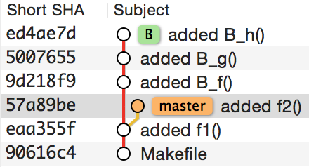

# Check out

I wanted to learn (some of) the details of git when merging, cherry-picking or rebasing. 

With the help of this Makefile I could easily switch to different test situations and analyze the outcome.

## How to use

Start with `make initial` to delete artefacts from former runs and initialize a git repo.

`make prep` creates a couple of commits including a branch "B". This is the starting point for different experiments.



From the starting point you can try one of the other make targets like, `make merge`, `make cherry-pick*`, etc.

**Hint:** To avoid merge conflicts every commit consists one one new file.

## Inspect the results

A graphical git client eases the inspections of the results, but textual command line output suffices in the worst case. Use e.g. `git log`, `git status`, etc.

To visualize relations and branches you can put something like

```
[alias]
    lg1 = log --graph --abbrev-commit --decorate --format=format:'%C(bold blue)%h%C(reset) - %C(bold green)(%ar)%C(reset) %C(white)%s%C(reset) %C(dim white)- %an%C(reset)%C(bold yellow)%d%C(reset)' --all
    lg2 = log --graph --abbrev-commit --decorate --format=format:'%C(bold blue)%h%C(reset) - %C(bold cyan)%aD%C(reset) %C(bold green)(%ar)%C(reset)%C(bold yellow)%d%C(reset)%n''          %C(white)%s%C(reset) %C(dim white)- %an%C(reset)' --all
```

in your `~/.gitconfig` and use it like this: `git lg1`.
